# Raspberry Pi 5 IoT Control System Setup Script
# V0.1

*Last updated: 2024-07-20

## Overview
This script automates the setup process for a Raspberry Pi 5 based IoT Control System. It includes the configuration of network, VPN, webserver, database, MQTT, backend, frontend, and ESP32 communication.

[Rest of the README content remains the same]

## Prerequisites
- Freshly installed Raspberry Pi OS (Bookworm or newer)
- Internet connection
- Sudo privileges for the executing user

## Usage
1. Clone the repository: `git clone https://github.com/yourusername/Raspi_Setup_Scripts.git`
2. Navigate to the project directory: `cd Raspi_Setup_Scripts`
3. Make the main script executable: `chmod +x setup_iot_system.sh`
4. Run the script: `sudo ./setup_iot_system.sh`

## Features
- GitHub integration (cloning or creating a project)
- Network configuration (Ethernet, WiFi, Access Point)
- VPN setup for secure remote access
- Webserver setup (Nginx)
- Database setup (SQLite)
- MQTT broker configuration
- Backend setup (Flask, Gunicorn)
- Frontend setup (React)
- ESP32 communication setup
- Monitoring setup (Prometheus, Grafana)
- Automated backups
- System check and restart functions
- Code export function

## Structure
- `setup_iot_system.sh`: Main script
- `modules/`: Directory for modular script components
- `utils/`: Directory for utility scripts
- `credentials.env`: Environment variables and configuration settings
- `docs/`: Documentation and generated reports

## Versioning
- v4.8.0: Current main version
- v4.8.1: Improved error handling and dependency management
- v4.8.2: Enhanced logging and troubleshooting capabilities

## Authors
- Patric Aeberhard

## License
This project is licensed under the MIT License. See the `LICENSE` file for details.

## Architecture Overview: IoT Control System v0.1

```mermaid
graph TD
    A[Raspberry Pi 5: IoT Control System v4.8.0] --> B[Network Setup v1.2.8]
    A --> C[Security v1.0.0]
    A --> D[Data Management v1.2.4]
    A --> E[Application Layer v1.2.3]
    A --> F[IoT Communication v1.2.2]
    A --> G[Monitoring & Maintenance v1.2.2]
    A --> H[System Management v1.1.0]

    B --> B1[WiFi Client]
    B --> B2[Access Point wlan1]
    B --> B3[IP Forwarding]

    C --> C1[OpenVPN v2.5.x]
    C --> C2[SSL/TLS Let's Encrypt]
    C --> C3[Firewall]

    D --> D1[SQLite v3.40.1]
    D --> D2[Backup System]

    E --> E1[Backend]
    E --> E2[Frontend]
    E1 --> E1a[Flask v2.x.x]
    E1 --> E1b[Gunicorn v20.x.x]
    E2 --> E2a[React v17.x.x]

    F --> F1[MQTT Broker Mosquitto v2.x.x]
    F --> F2[MQTT Bridge]
    F --> F3[ESP32 Integration]

    G --> G1[Prometheus v2.30.x]
    G --> G2[Grafana v8.x.x]
    G --> G3[Node Exporter v1.2.x]

    H --> H1[System Check]
    H --> H2[System Restart]
    H --> H3[Code Export]

    classDef default fill:#f9f,stroke:#333,stroke-width:2px;
    classDef module fill:#bbf,stroke:#333,stroke-width:2px;
    classDef component fill:#dfd,stroke:#333,stroke-width:2px;
    
    class A default;
    class B,C,D,E,F,G,H module;
    class B1,B2,B3,C1,C2,C3,D1,D2,E1,E2,F1,F2,F3,G1,G2,G3,H1,H2,H3 component;
```

## Open Issues and Future Improvements

### Current Open Issues:
1. **Dependency Management**: The system is experiencing difficulties in correctly identifying and managing module dependencies. This leads to issues where modules may not execute in the correct order or fail to recognize completed dependencies.

2. **Module Execution Errors**: Some modules, particularly the GitHub setup, are encountering execution errors. This may be due to issues with environment variable loading or script sourcing.

3. **Error Handling**: The current error handling system needs improvement to provide more detailed and user-friendly error messages, especially for dependency-related issues.

4. **Logging Consistency**: There are inconsistencies in logging across different modules, making it challenging to debug issues effectively.

### Planned Improvements:
1. **Refactor Dependency System**: Implement a more robust dependency tracking system that can handle complex inter-module dependencies and provide clearer feedback to users.

2. **Enhanced Error Reporting**: Develop a more comprehensive error reporting system that provides detailed, actionable information to users when issues occur.

3. **Modularization Review**: Conduct a thorough review of the modular structure to ensure that each module is sufficiently independent and well-encapsulated.

4. **Automated Testing**: Implement a suite of automated tests to verify the functionality of individual modules and their interactions.

5. **User Interface Improvements**: Enhance the command-line interface to provide a more intuitive and informative user experience throughout the setup process.

6. **Documentation Expansion**: Expand the documentation to include troubleshooting guides, detailed module descriptions, and configuration examples.

7. **Performance Optimization**: Analyze and optimize the performance of resource-intensive modules, particularly for systems with limited hardware capabilities.

8. **Security Enhancements**: Conduct a security audit and implement additional measures to protect sensitive information and secure system components.

## Next Steps
- Complete integration and testing of all modules
- Improve user-friendliness and error handling
- Expand documentation and add configuration examples
- Implement additional security features
- Optimize performance and resource utilization
- Address open issues, particularly focusing on dependency management and module execution reliability

We appreciate your patience as we work to resolve these issues and improve the overall stability and functionality of the IoT Control System setup script.
